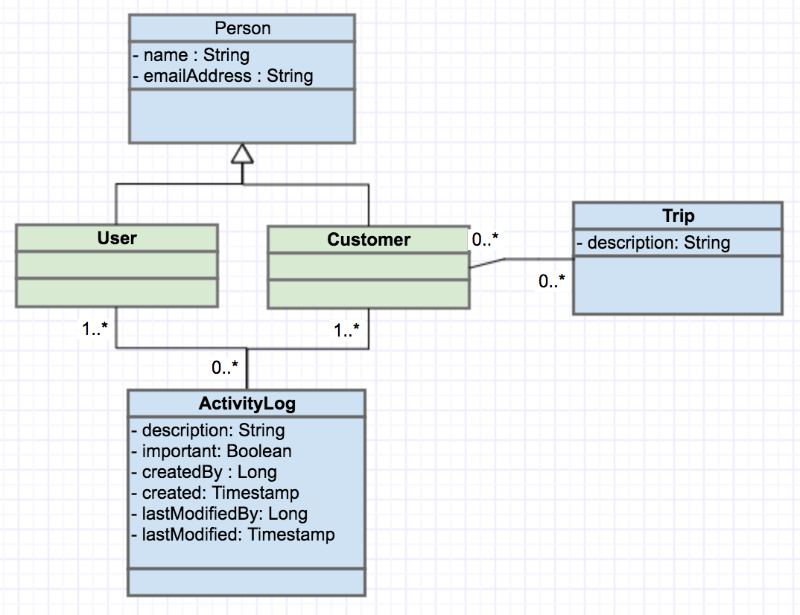

# Mystic Dream: Customer API


## Overview
The support team at Mystic Dream is streamlining their customer logistics. With a spike in new customers, it is more difficult to manage and track all the steps involved in scheduling customer trips. An interface has been built.

The goal of this project is to build two APIs that:
 
* Manage customer information
* Manage and track steps in the planning process

## Code template
This code borrows heavily from a [Spring REST tutorial](http://spring.io/guides/tutorials/bookmarks/) as well as the [Katharsis Spring example](https://github.com/katharsis-project/katharsis-framework/tree/master/katharsis-examples/spring-boot-simple-example).

## Dependencies
The code uses: 

* [Spring Boot](https://projects.spring.io/spring-boot/)
* H2
* [Maven](https://maven.apache.org/index.html)
* [Katharsis](http://katharsis.io/) (to implement json:api)

## Running with Maven
```
$ mvn clean spring-boot:run
```

## Calls
I found [Postman](https://www.getpostman.com/) invaluable for testing the calls. It is available as a Chrome extension or Mac/Windows/Linux application.

```
# Get all customers
GET http://localhost:8080/api/customer/

# Sorted by name ASC
GET http://localhost:8080/api/customer/?sort=name

# Sorted by name DESC
GET http://localhost:8080/api/customer/?sort=-name
```

```
# Get customer id 1
GET http://localhost:8080/api/customer/1
```

```
# Create new customer
POST http://localhost:8080/api/customer/

# body; type: json
  {
  	"data": {
  		"type": "customer",
  		"attributes": {
  			"emailAddress": "diana@fake.email",
  			"name": "diana"
  		}
  	}
  }
```

```
# Update customer id 5	
PATCH http://localhost:8080/api/customer/5

# body; type: json
  {
    "data": {
      "type": "customer",
      "attributes": {
        "name": "wonder woman"
      }
    }
  }
```

```
# Create new trip
POST http://localhost:8080/api/trip

# body; type: json
  {
    "data": {
      "type": "trip",
      "attributes": {
        "description": "Gotham City"
      }
    }
  }
```

```
# Get all internal users
GET http://localhost:8080/api/user
```

```
# Create a new internal user
POST http://localhost:8080/api/user/

# body; type: json
  {
  	"data": {
  		"type": "user",
  		"attributes": {
  			"emailAddress": "owl@admin.email",
  			"name": "Owl"
  		}
  	}
  }
```

```
# Get all activity log records
GET http://localhost:8080/api/activityLog
```

``` 
# Create activity log entry for customer 3; by user 2
POST http://localhost:8080/api/activityLog

# body; type: json
  {
    "data": {
      "type": "activityLog",
      "attributes": {
          "description": "Customer called wanting a trip",
          "createdById": "2"
      },
      "relationships": {
      	"user" : {
      		"data": {
      			"id": "2",
      			"type": "user"
      		}
      	},
      	"customer": {
          	"data": {
          		"id": "3",
              	"type": "customer"
       		}
  		}
    	}
  	}
  }
```

```
# Customer 3 signs up for a trip; handled by admin user 2
POST http://localhost:8080/api/activityLog

# body; type: json
  {
    "data": {
      "type": "activityLog",
      "attributes": {
          "description": "Customer signed up for trip to Gotham City",
          "createdById": "2"
      },
      "relationships": {
      	"user" : {
      		"data": {
      			"id": "2",
      			"type": "user"
      		}
      	},
      	"customer": {
          	"data": {
          		"id": "3",
              	"type": "customer"
       		}
  		}
      }
  	}
  }

# Update customer and trip records to reflect trip
# Note that this is a different url format
POST http://localhost:8080/mystic/3/addTrip/5
```

```
#  Remove a trip from customer 3
POST http://localhost:8080/api/activityLog

# body; type: json
  {
    "data": {
      "type": "activityLog",
      "attributes": {
          "description": "Customer removed trip to Gotham City",
          "createdById": "2"
      },
      "relationships": {
      	"user" : {
      		"data": {
      			"id": "2",
      			"type": "user"
      		}
      	},
      	"customer": {
          	"data": {
          		"id": "3",
              	"type": "customer"
       		}
  		}
    	}
  	}
  }

# Update customer and trip records to reflect trip
# Note that this is a different url format
POST http://localhost:8080/mystic/3/removeTrip/5
```

```
# Get entire activity log for customer 3
GET http://localhost:8080/api/customer/3/relationships/activityLog
```

```
# View all customers going on trip 4
GET http://localhost:8080/api/trip/4/customers
```


```
#  View the activity logs created by admin user 1, sorted by lastModified DESC
GET http://localhost:8080/api/activityLog/?filter[user][id]=1&sort=-lastModified
```

### Filtering and Sorting
As shown in some of the sample calls, [filtering](http://katharsis-jsonapi.readthedocs.io/en/latest/user-docs.html#filtering) and [sorting](http://katharsis-jsonapi.readthedocs.io/en/latest/user-docs.html#sorting) is built in.

## Implementation

### Class structure


## Code
Assuming that a Spring application is created from the [Spring REST tutorial](http://spring.io/guides/tutorials/bookmarks/), this will focus on the changes needed to integrate Karthasis and json:api.

### Spring originated code
```
dream.mystic/
    MysticDreamApplication.java
dream.mystic.controller/
    MysticController.java
dream.mystic.domain/
    ActivityLog.java
    Customer.java
    Person.java
    Trip.java
    User.java
dream.mystic.repository/
    ActivityLogRepository.java
    CustomerRepository.java
    TripRepository.java
    UserRepository.java
```

### Files required for Katharsis
```
dream.mystic/
    JpaConfig.java
    ModuleConfig.java
dream.mystic.repository.jsonapi/
    ActivityLogResourceRepository.java
    ActivityLogToCustomerRelationshipRepository.java
    ActivityLogToUserRelationshipRepository.java
    CustomerResourceRepository.java
    CustomerToActivityLogRelationshipRepository.java
    CustomerToTripRelationshipRepository.java
    TripResourceRepository.java
    TripToCustomerRelationshipRepository.java
    UserResourceRepository.java
    UserToActivityLogRelationshipRepository.java
```

The files in the `jsonapi` package breakdown as:

* `*ResourceRepository.java` is the Katharsis equivalent to the JPA *Repository.java files. Katharsis uses these files to publish API operations
* `<X>To<Y>RelationshipRepository.java` files handle the unidirectional relationships between resources X and Y. This is required when there is an annotation `@JsonApiToOne` or `@JsonApiToMany` of field Y in the X class. 
    + Because `<X>To<Y>` is unidirectional, there also needs to be a `<Y>To<X>RelationshipRepository.java` file to handle the other side of the relationship.

### Pom.xml
Add the following dependencies to the `pom.xml` file.

```xml
    <dependency>
      <groupId>io.katharsis</groupId>
      <artifactId>katharsis-spring</artifactId>
      <version>3.0.1</version>
    </dependency>

    <dependency>
      <groupId>io.katharsis</groupId>
      <artifactId>katharsis-validation</artifactId>
      <version>3.0.1</version>
    </dependency>
    
    <dependency>
      <groupId>io.katharsis</groupId>
      <artifactId>katharsis-jpa</artifactId>
      <version>3.0.1</version>
    </dependency>
```

### Classes / Models / Resources
Each class needs to have a `@JsonApiResource` annotation. This defines a resource and is used in the URLs and type field in all passed JSONs.

```java
@Entity
@JsonApiResource(type = "customer")
@SuppressWarnings("deprecation")
public class Customer extends Person{
...
```

### IDs
Within each Class/Model/Resource, an ID needs to be annotated with `@JsonApiId`. This enables a resource to be properly identified.

```java
@Entity
@JsonApiResource(type = "trip")
@SuppressWarnings("deprecation")
public class Trip {
  
  @Id
  @GeneratedValue
  @JsonApiId
  private Long id;
  ...
```

### Relationships
If a Class/Resource has an association with another resource, the field needs to have an annotation of `@JsonApiToMany` or `@JsonApiToOne`.

```java
@Entity
@JsonApiResource(type = "customer")
@SuppressWarnings("deprecation")
public class Customer extends Person{
  
  // Karthasis might not fully support inheritance and 
  // different sets of activityLogs
  @JsonApiToMany(opposite = "customer")
  @OneToMany(mappedBy = "customer")
  private List<ActivityLog> activityLog = new ArrayList<ActivityLog>();
  
  @JsonApiToMany(opposite = "customers")
  @ManyToMany(fetch = FetchType.EAGER, mappedBy = "customers")
  private Set<Trip> trips = new HashSet<Trip>();
```

_Note that in the snippet above, `FetchType.EAGER` was set instead of `FetchType.LAZY`. This was a workaround to deal with the many-to-many relationship._

```java
@Entity
@JsonApiResource(type = "activityLog")
@SuppressWarnings("deprecation")
public class ActivityLog {
  
  @JsonApiId
  @Id
  @GeneratedValue
  private Long id;
  
  @JsonApiToOne(opposite="activityLog")
  @JsonApiIncludeByDefault
  @OneToOne
  private Customer customer;
```

### ResourceRepositories
As mentioned above, ResourceRepositories are used to publish API operations. It is also important to annotate each class with `@Component` to expose the resource via reflection.

```java
@Component
public class TripResourceRepository extends ResourceRepositoryBase<Trip,Long> {

  @Autowired
  private TripRepository tripRepository;
  
  public TripResourceRepository() {
    super(Trip.class);
  }

  @Override
  public synchronized <S extends Trip> S save(S trip) {
            tripRepository.save(trip);
            return trip;
  }
  
  @Override
  public Trip findOne(Long tripId, QuerySpec arg0) {
    return tripRepository.findOne(tripId);
  }
  
  @Override
  public ResourceList<Trip> findAll(QuerySpec arg0) {
    return arg0.apply(tripRepository.findAll());
  }
}
```

Because this application uses an in-memory database, the operations to retrieve or save interact with the JPA classes.

### RelationshipRepositories
As mentioned above, RelationshipRepositories are used to handle the relationships between resources that were annotated with `@JsonApiToMany` or `@JsonApiToOne`. Just like with the ResourceRepositories, the `@Component` annotation is required to expose the resource via reflection.

A simple one-to-one or one-to-many implementation.

```java
@Component
public class ActivityLogToUserRelationshipRepository extends RelationshipRepositoryBase<ActivityLog, Long, User, Long> {

  public ActivityLogToUserRelationshipRepository() {
    super(ActivityLog.class, User.class);
  }

}
```

The implementation is much more verbose for a many-to-many relationship.

```java
@Component
public class CustomerToTripRelationshipRepository extends RelationshipRepositoryBase<Customer, Long, Trip, Long> {

  @Autowired
  private CustomerRepository customerRepository;
  
  @Autowired 
  private TripRepository tripRepository;
  
  public CustomerToTripRelationshipRepository() {
    super(Customer.class, Trip.class);
  }

  @Override
    public void setRelation(Customer customer, Long tripId, String fieldName) {
        // not for many-to-many
    }

    @Override
    public void setRelations(Customer customer, Iterable<Long> tripIds, String fieldName) {
        final Set<Trip> trips = new HashSet<Trip>();
        trips.addAll(tripRepository.findAll(tripIds));
        customer.setTrips(trips);
        customerRepository.save(customer);
    }

    @Override
    public void addRelations(Customer customer, Iterable<Long> tripIds, String fieldName) {
        final Set<Trip> trips = customer.getTrips();
        trips.addAll(tripRepository.findAll(tripIds));
        customer.setTrips(trips);
        customerRepository.save(customer);
    }

    @Override
    public void removeRelations(Customer customer, Iterable<Long> tripIds, String fieldName) {
        final Set<Trip> trips = customer.getTrips();
        trips.removeAll(tripRepository.findAll(tripIds));
        customer.setTrips(trips);
        customerRepository.save(customer);
    }

    @Override
    public ResourceList<Trip> findManyTargets(Long sourceId, String fieldName, QuerySpec args0) {
        final Customer customer = customerRepository.findOne(sourceId);
        return args0.apply(customer.getTrips());
    }
    
}
```

#### Note
I had trouble implementing the POST/PATCH calls via json:api to update the many-to-many relationship. In this particular project, a customer can go on many different trips. A trip can be taken by many different customers. When a customer signs up for a trip, I need to update this new join relationship instance.

The workaround was to do this in code via a RESTful Spring call. This is why the Calls section noted a different URL for specific operations.

```java
@RestController
@RequestMapping("/mystic")
public class MysticController {
...
  /**
   * 
   *  Handles the deletion of one trip to a customer
   *  Handles the deletion of one customer to a trip
   * @param customerId
   * @param tripId
   * @return
   */
  @RequestMapping(method = RequestMethod.POST, value = "/{customerId}/addTrip/{tripId}")
  public void updateCustomerWithTrip(@PathVariable Long customerId, @PathVariable Long tripId) {
    updateCustomerTrip(customerId, tripId, true);
  }
  
  /**
   * 
   *  Handles the deletion of one trip to a customer
   *  Handles the deletion of one customer to a trip
   * @param customerId
   * @param tripId
   * @return
   */
  @RequestMapping(method = RequestMethod.POST, value = "/{customerId}/removeTrip/{tripId}")
  public void updateCustomerWithoutTrip(@PathVariable Long customerId, @PathVariable Long tripId) {
    updateCustomerTrip(customerId, tripId, false);
  }
  
  /**
   *  Helper function to update customer and trip objects
   * @param customerId
   * @param tripId
   * @param add
   */
  private void updateCustomerTrip(Long customerId, Long tripId, Boolean add) {
    
    Optional<Trip> tripCheck = tripRepository.findById(tripId);
    Optional<Customer> customerCheck = customerRepository.findById(customerId);
    
    if(customerCheck.isPresent() && tripCheck.isPresent()) {    
      Customer customer = customerCheck.get();
      Trip trip = tripCheck.get();
      
      if(add) {
        customer.addTrip(trip);
        trip.addCustomer(customer);
      } else {
        customer.removeTrip(trip);
        trip.removeCustomer(customer);  
      }
      
      customerRepository.save(customer);
      tripRepository.save(trip);
    }
  }
...
```

### Main class
The main class needs to also be ammended to tie everything together. The primary changes include the `@Import` annotation with `KatharsisConfigV3.class`. The `getResources()` publishes all the available json:api calls at `GET http://localhost:8080/api/resourcesInfo`.

```java
@Configuration
@RestController
@SpringBootApplication
@Import({ KatharsisConfigV3.class, JpaConfig.class, ModuleConfig.class })
public class MysticDreamApplication {
  
  @Autowired
  private ResourceRegistry resourceRegistry;

  @RequestMapping("/resourcesInfo")
  public Map<?, ?> getResources() {
    Map<String, String> result = new HashMap<>();
    // Add all resources for API exposure
    for (RegistryEntry entry : resourceRegistry.getResources()) {
      result.put(entry.getResourceInformation().getResourceType(), resourceRegistry.getResourceUrl(entry.getResourceInformation()));
    }
    return result;
  }
  
  // Spring Boot 
  public static void main(String[] args) {
    SpringApplication.run(MysticDreamApplication.class, args);
  }
```